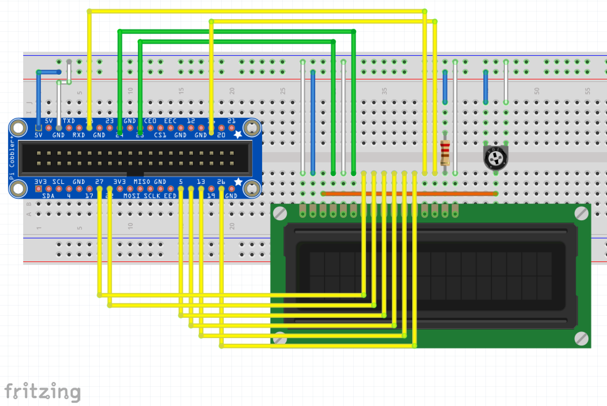

# CharacterLCD
CharacterLCD is a .NET library to control a character LCD on the Raspberry Pi 2 running Windows 10 IoT Core.

# Methods
- Initializer : initialize the LCD
- ClearLCD : clear the text on the LCD
- Dispose : close the pins
- WriteLCD : dislay a string on the LCD

# Usage
## Preparation
In order to use this you need to have Windows 10 IoT Core set up on your Raspberry Pi 2.
You can visit this [url](http://ms-iot.github.io/content/win10/SetupRPI.htm) to do this.
## Connect
After your Raspberry Pi has been setup you need to connect a character LCD to it.

If you want you can connect the LCD using different pins. You can specify the different pins in the initializer. Be sure to check the [pin availability](http://data.designspark.info/uploads/images/53bc258dc6c0425cb44870b50ab30621)
## Test
There is a sample application included to test the display. By default it should output 'Hello world!'. The app itself can be used to display a custom text on the LCD.
## App
You can integrate this library into your own app. It is available on [NuGet](https://www.nuget.org/packages/CharacterLCD/1.0.0)

# Development
This library is not yet finished. I will try to extend and improve the library.

# Contribute
If you find mistakes, things that could be done better, feel free to contribute!

# Copyright
Copyright (&copy;) 2015 Bart Callant.

Distributed under the MIT License.
